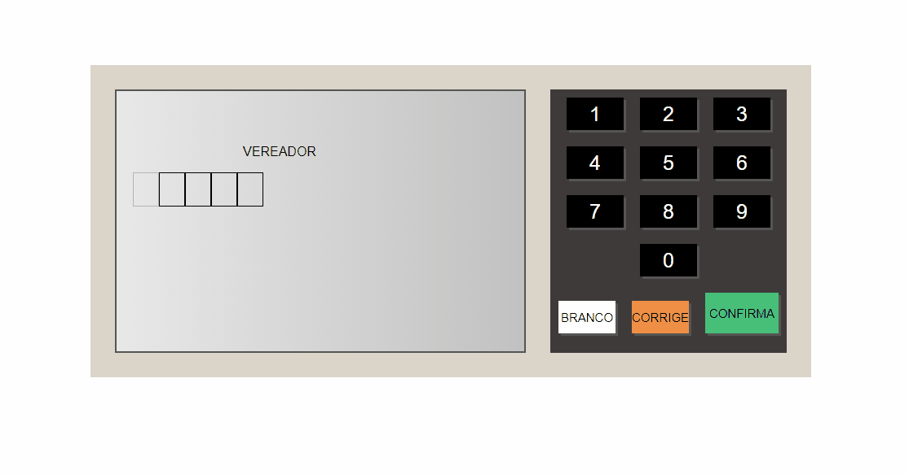

<div align="center" id="top"> 
  

&#xa0;

  <!-- <a href="https://urna.netlify.app">Demo</a> -->
</div>

<h1 align="center">Urna</h1>

<p align="center">
  

  

  

  

</p>

<!-- Status -->

<!-- <h4 align="center">
	🚧  Urna 🚀 Under construction...  🚧
</h4>

<hr> -->

<p align="center">
  <a href="#dart-about">About</a> &#xa0; | &#xa0; 
  <a href="#sparkles-features">Features</a> &#xa0; | &#xa0;
  <a href="#rocket-technologies">Technologies</a> &#xa0; | &#xa0;
  <a href="#white_check_mark-requirements">Requirements</a> &#xa0; | &#xa0;
  <a href="#checkered_flag-starting">Starting</a> &#xa0; | &#xa0;
  <a href="#memo-license">License</a> &#xa0; | &#xa0;
  <a href="https://github.com/{{YOUR_GITHUB_USERNAME}}" target="_blank">Author</a>
</p>

<br>

## :dart: About

Projeto de urnas semelhantes às urnas eleitorais brasileiras, utilizando a linguagem de programação Javascript, a linguagem de marcação HTML5, e a linguagem de estilização CSS3. Projeto realizado para prática e fixação das linguagens citadas e para adquirir mais conhecimento e confiança!

## :rocket: Technologies

The following tools were used in this project:

- [JS](https://developer.mozilla.org/pt-BR/docs/Web/JavaScript)
- [HTML5](https://developer.mozilla.org/pt-BR/docs/Web/HTML)
- [CSS#](https://developer.mozilla.org/pt-BR/docs/Web/CSS)

## :white_check_mark: Requirements

Before starting :checkered_flag:, you need to have [Git](https://git-scm.com) installed.

## :checkered_flag: Starting

```bash
# Clone this project
$ git clone https://github.com/{{GabrielPh7}}/urna

# Access
$ cd urna

# Install dependencies
$ yarn

# Run the project
$ yarn start

# The server will initialize in the <http://localhost:3000>
```

## :memo: License

This project is under license from MIT. For more details, see the [LICENSE](LICENSE.md) file.

Made with :heart: by <a href="https://github.com/{{GabrielPh7}}" target="_blank">{{Gabriel Phillipe}}</a>

&#xa0;

<a href="#top">Back to top</a>
